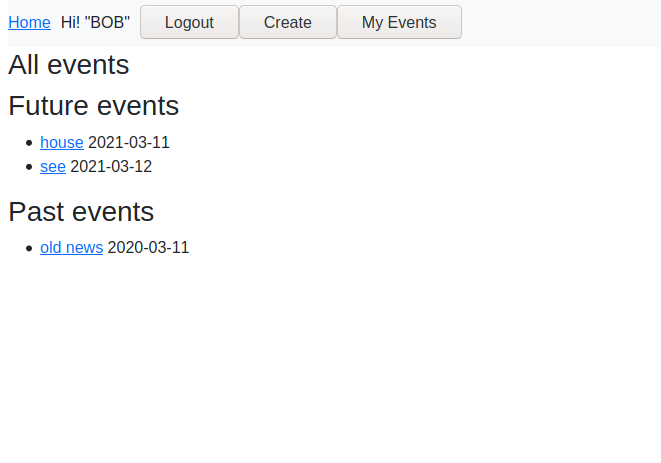

# Events handler site
> This site is about creating events as a user, so that other users can sing up for them.



Anonymous users can:
  Click an event to see it's description and who is going
  Log in
  Create a new account

Logged in users can:
  Create new Events
  Subscribe to other events by clicking the Attend button

## Built With

Ruby 3.0.0 
Rails 6
HTML5
Bootstrap (CDN)

## Getting Started

**This is an example of how you may give instructions on setting up your project locally.**
**Modify this file to match your project, remove sections that don't apply. For example: delete the testing section if the currect project doesn't require testing.**

To get a local copy up and running follow these simple example steps.

### Install
```
Clone the [repo](https://github.com/JohnHernCode/private-ev)
In the terminal, cd 'private-ev'
run 'bundle install'
run 'rails db:create'
run 'rails db:migrate'
```
### Usage
```
run 'rails s'
In your browser, go to [localhost:3000](http://127.0.0.1:3000)
To create a user, click the 'Sign up' button in the navbar. Write a username and click on 'Create'
To create a user session, click the 'Login' button in the navbar. Write a username and click on 'Login'
To create an Event, click on 'Create' in the navbar after logging in
In the main page, you can click on any event to see it's contents
You can check your own events by clicking the 'My Events' button
```
### Testing

```
In your terminal type rspec
The results of the test will populate

```

## Authors

👤 **John hernandez**
- GitHub: [@johnhernandez-code](https://github.com/johnhernandez-code)
- Twitter: [@JohnHernCode](https://twitter.com/JohnHernCode)
- LinkedIn: [John Hernandez](https://www.linkedin.com/in/john-hernandez-56a7821b8/) 

👤 **Rodrigo Ibaceta**

- GitHub: [Rodrigo Ibateca](https://github.com/RokoVarano/)
- Twitter: [@Rodrigo](https://twitter.com/RodrigoIbacet11)
- LinkedIn: [LinkedIn](https://www.linkedin.com/in/rodrigo-ibaceta-a8657611a/)

## 🤝 Contributing

Contributions, issues, and feature requests are welcome!

Feel free to check the [issues page](issues/).

## Show your support

Give a ⭐️ if you like this project!

## Acknowledgments

Hat tip to anyone whose code was used
Inspiration
etc

## 📝 License

This project is [MIT](lic.url) licensed.